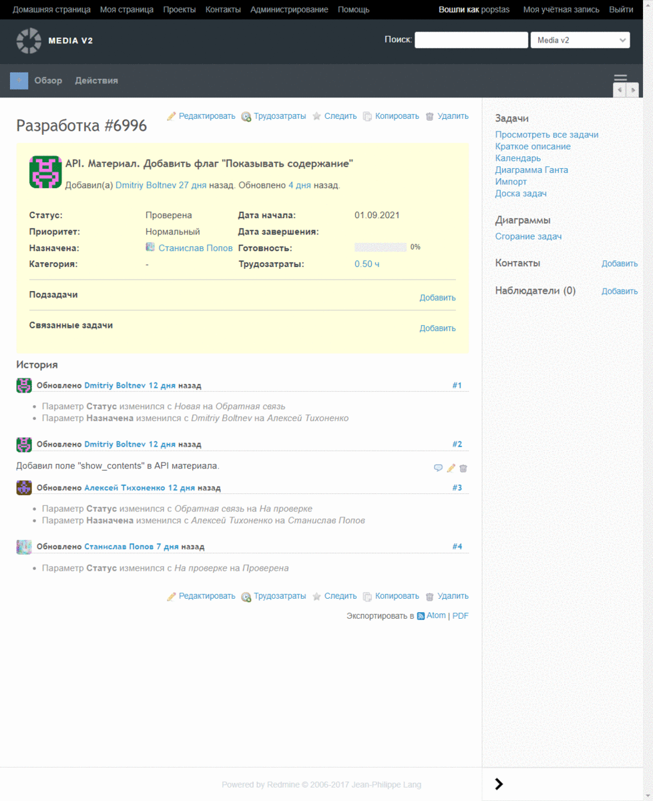
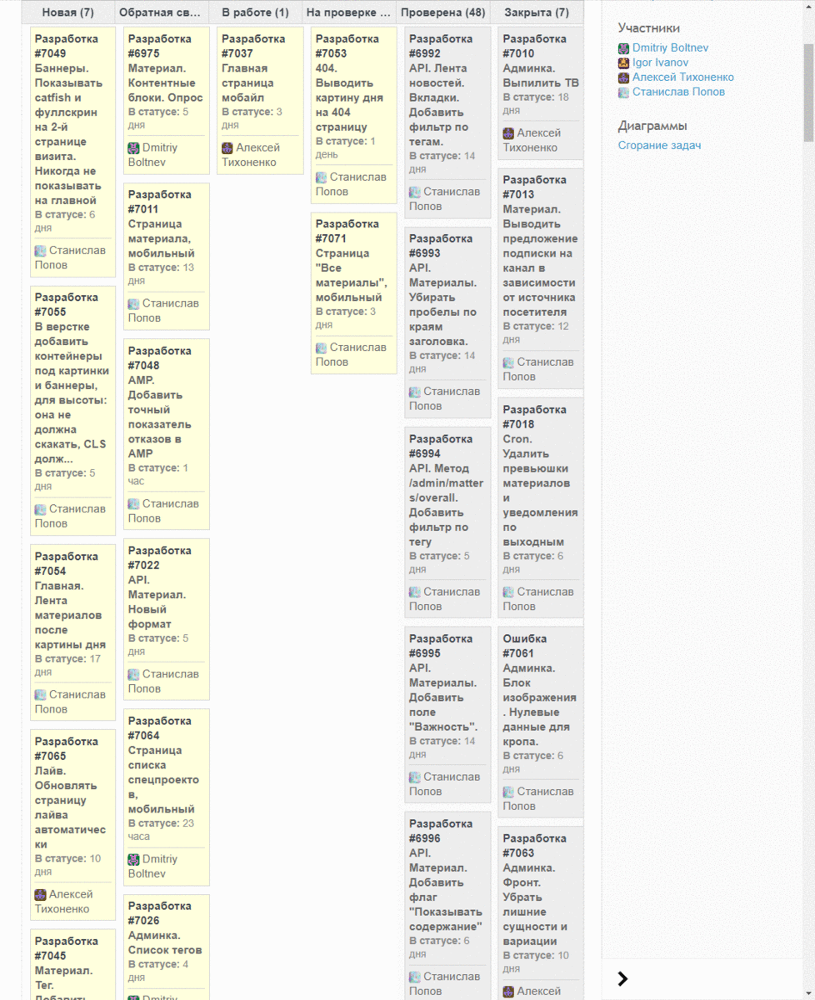

Юзерскрипт для быстрой простановки аналитик выработки и оформления смет.

Задача:

Доска:

## Возможности
- Делает страницы таска и карточек (Agile) более компактными и читаемыми
- Компонует всю доп. инфу в строку шапки карточки/коммента
- Дизайн позаимствован у Планфикса

## Установка
1. Поставьте Tampermonkey для 
   [Chrome](https://chrome.google.com/webstore/detail/tampermonkey/dhdgffkkebhmkfjojejmpbldmpobfkfo?hl=ru)
   или
   [Firefox](https://addons.mozilla.org/en-US/firefox/addon/tampermonkey/)
2. Перейдите на [страницу расширения](https://github.com/1mi/userscript-redmine-delo/raw/master/dist/redmine-delo.user.js)
3. На открывшейся странице нажмите Установить

## Обновление
Скрипт обновляется автоматически.
Чтобы обновить вручную, нажмите Проверить обновления сриптов. Вылезет всплывалка, что идет проверка, 
если потом ничего не произойдет, значит скрипт обновится.

Чтобы проверить, что скрипт последней версии, перейдите [сюда](https://github.com/1mi/userscript-redmine-delo/raw/master/dist/redmine-delo.user.js).
